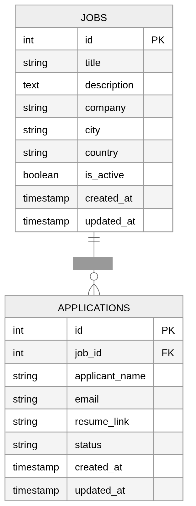

---

# Kazi Link MERN Job Portal – Stage 1 Backend

## 🚀 Overview

This is the **backend** for Stage 1 of the Kazi Link Job Portal, focused on **Traffic First, Auth Later**.
At this stage, the backend serves **public job listings** and **search functionality** without requiring user authentication.


---

## 🌐 Deployed Backend

>
> `https://kazi-link.onrender.com/`

The goal is to **deliver value fast**, maintain performance, and set up a scalable architecture for later stages.

---

## 🎯 Objectives

* Serve **public job listings** to attract users.
* Optimize database queries using **`.lean()`** and selective fields for speed.
* Enable **searchable and filterable job data**.
* Prepare for **future authentication, dashboards, and monetization**.

---

## 🛠️ Tech Stack

* **Node.js**
* **Express.js**
* **MongoDB** (Atlas or local)
* **Mongoose** (ODM)
* **TypeScript** for type safety

---

## 📂 Project Structure
The link below contains the project structure 

[project structure - stage1](docs/images/stage1-backend-project-structure.png)
---

## 🔹 Features (Stage 1)

* **Public job listings**
* **Search and filtering** (basic)
* **Pagination** for performance
* Optimized queries using **Mongoose `.lean()`**
* **Type-safe operations** with TypeScript

**Not included yet:**

* Authentication (JWT / OAuth)
* User dashboards
* Paid features or notifications

---

## ⚡ Setup Instructions

### Prerequisites

* Node.js v18+
* npm or yarn
* MongoDB instance (local or Atlas)

### Installation

```bash
# Clone the repo
git clone https://github.com/yourusername/kazi-link.git
cd kazi-link/server

# Install dependencies
npm install
```

### Running the Backend

```bash
# Start development server with hot reload
npm run dev
```

The API server will run on `http://localhost:5000` by default.

---

## 📝 API Endpoints (Stage 1)

### 📌 Jobs

| Method | Endpoint | Description |
|------|----------|-------------|
| POST | /jobs | Create a new job listing |
| GET | /jobs | Get all public job listings |
| GET | /jobs/:id | Get job details by ID |
| PATCH | /jobs/:id | Update an existing job |
| DELETE | /jobs/:id | Delete or deactivate a job |
| GET | /jobs/search | Search or filter job listings |
| GET | /jobs/location/:city | Get jobs filtered by city |
| GET | /jobs/country/:country | Get jobs filtered by country |

---

### 📄 Applications

| Method | Endpoint | Description |
|------|----------|-------------|
| POST | /applications | Submit a job application |
| GET | /applications/:jobId | Get applications for a specific job |
| DELETE | /applications/:id | Delete an application |

---

### 📊 Analytics

| Method | Endpoint | Description |
|------|----------|-------------|
| POST | /analytics/job-view | Track a job view event |
| POST | /analytics/search | Track a search query |
| GET | /analytics/jobs/:id | Get analytics data for a job |

---

### ⚙️ System

| Method | Endpoint | Description |
|------|----------|-------------|
| GET | /health | Check API/server health status |

> Additional endpoints will be added in Stage 2 (authentication, dashboards, paid features).

### Database Relationship Description
Jobs (1) ──< Applications (many)

Jobs ↔ Applications:
- One Job can have many Applications.
- Each Application belongs to one Job.
NB: Locations (city/country) are hardcoded in the app, so there is no table relationship for locations.

[](./docs/images/phase1-erd.png)

---

## 💡 Notes / Best Practices

* Keep **controllers thin**: delegate logic to `services/`.
* Use **constants** and `types/` for consistency and maintainability.
* Optimize **database queries** for performance early.
* Design API responses with **future scalability** in mind.

---

## 📄 License

MIT License © Elaine Muhombe

---


